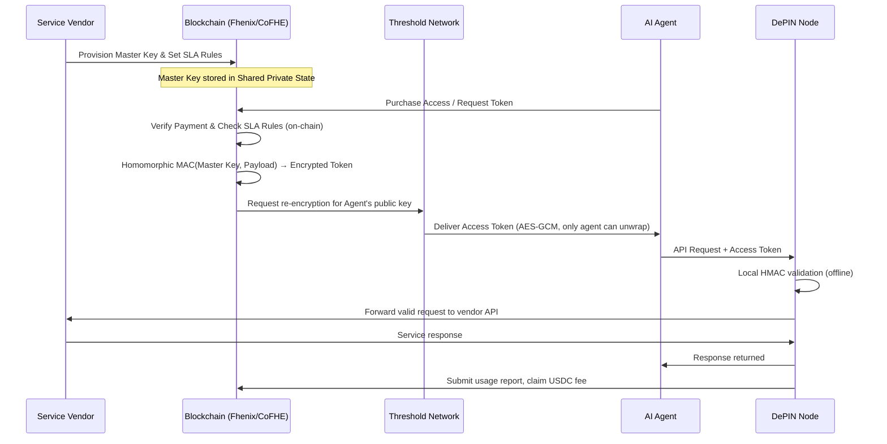

## 1. Elaborated Requirements.md

---

## 1. Project Overview

The **Agentic Secret Management (ASM)** system is a decentralized infrastructure designed to allow AI agents to use sensitive API credentials and perform paid actions without ever "seeing" the actual secrets. By leveraging **shared private state** on-chain via Fully Homomorphic Encryption (FHE), the system enables a secondary market for API access, programmable service-level agreements (SLAs), and cryptographically secure "blind" execution.

The system is built on two interlocking primitives: FHE for credential confidentiality and HMAC for offline token validation. Together these replace the trust assumptions of traditional API key management - vendor 
honesty and centralized enforcement - with cryptographic guarantees around credential usage and request validity. Operational guarantees such as uptime and SLA enforcement are outside the scope of this system.

---

## 2. Problem Statement

**Credential Leakage:** AI agents currently require plaintext secrets to call external APIs. These secrets pass through model context windows, chat logs, and memory systems - all of which are potential leak surfaces. A single model provider breach, a careless prompt export, or a training data inclusion can expose every credential an agent has ever handled. There is no cryptographic mechanism today that allows an agent to use a credential it cannot read.

**Underutilized Assets:** Enterprise API subscriptions are purchased in bulk tiers. A company that pays for 10 million OpenAI tokens per month rarely uses exactly that amount. The unused balance expires worthless. There is no secure, trustless mechanism to resell or delegate that remaining access without sharing the underlying credential - which would violate the vendor's terms and expose the key.

**Payment Friction:** Existing agentic payment protocols (like x402) require multiple round-trips between agent, payment processor, and vendor before a request is served. This adds latency, complexity, and additional trusted intermediaries. For high-frequency agentic workloads - where an agent may make thousands of API calls per hour - this overhead is unacceptable.

---

## 3. The Solution: The "Blind Courier" Model

The system treats the AI agent as a **Blind Courier**. The agent receives an Access Token that is encrypted specifically for the Service Vendor. The agent can pass this token to the Vendor to prove it has permission to use a service, but the agent itself cannot decrypt the token to see the underlying secret.

**What this enables that didn't exist before:**

- An AI agent can call a paid API without the agent operator knowing which API key was used
- A vendor can issue tokens to agents they have never interacted with directly, automatically, 24/7
- An organization can delegate API access to agents without sharing credentials with the agent developer
- Token issuance and usage counts are recorded on-chain, enabling independent verification that access was granted and how many times a token was consumed - without exposing the underlying key

---

## 4. User Roles

**Service Vendors:** Companies or individuals who provide APIs or services. They generate a master key locally, encrypt it via FHE, and deposit it on-chain once. They define pricing, rate limits, TTL windows, and compliance rules in the smart contract. After initial provisioning, vendors do not need to operate any infrastructure for token issuance - the blockchain handles it. Vendors do operate an API endpoint and they run a lightweight validation process for incoming requests.

**Resource Owners (Users):** Individuals or organizations that purchase API access. They pay to the smart contract and receive an Access Token. They can use this token directly or delegate it to AI agents. In the future resale market, they can list unused quota for automated resale - for example, selling the remaining 40% of a monthly API subscription to other buyers without ever exposing the underlying credential.

**AI Agents:** Autonomous software processes acting on behalf of users. They can purchase Access Tokens by interacting directly with smart contract, include them in HTTP request, and receive API responses. They are cryptographically blind to the credential while being able to use it.

**DePIN Node Operators:** Independent infrastructure operators who run validator proxy nodes. They stake collateral, validate incoming Access Tokens via local HMAC recomputation, forward valid requests to vendor API endpoints, return responses to agents, and earn per-request fees. They are the decentralized replacement for a vendor-operated API gateway. They cannot read master keys or token contents - they only verify that the derived key's HMAC is valid.

---

## 5. Key Features

**Programmable On-Chain SLAs:** Vendors can enforce complex rules without revealing the user's data or the vendor's internal criteria. Examples: "only issue tokens to wallets with a Self Protocol KYC proof", "only issue tokens to wallets that have held a specific NFT for more than 30 days", "reject issuance if the buyer's wallet is on the OFAC sanctions list". These checks run on encrypted identity data using FHE comparisons - the rule executes and produces a yes/no result without any private data being exposed.

**Wallet-Bound Token Issuance:** Every derived key is cryptographically bound to the buyer's Ethereum wallet address - it is an explicit input to the HMAC function. A key derived for wallet `0xABC...` cannot be used from wallet `0xDEF...`. This replaces bearer-token semantics (anyone who has the key can use it) with identity-bound semantics (only the specified wallet can produce a valid key).

**Automated Resale Market (Future):** Owners can "prorate" their API access. If an owner has 50% of their monthly quota left, the system allows them to sell that remaining access to an agent automatically. The cryptographic design for homomorphic rate-limit subdivision and double-spend prevention is an open problem - this feature is scoped for a future version.

**Confidential Governance:** DAO treasuries or organizations can manage their service subscriptions and payments privately, hiding their operating costs from competitors. The on-chain record shows that a payment was made and a token was issued, but not which service was accessed or what rules were applied - those live in encrypted SLA state.

**One-Step Agentic Payments:** Replaces the multi-step "402" flow. The payment and the access proof are bundled into a single encrypted token delivery. The agent pays once, receives a session token valid for N hours or M requests, and includes it in every subsequent request header. No per-request payment, no additional round-trips.

**Full On-Chain Audit Trail:** Every token issuance is recorded on-chain as a keccak256 commitment. Every DePIN node usage report is submitted on-chain in batched merkle proofs. The result is a complete, tamper-evident usage log - auditable by any party - that never reveals the underlying credentials.

---

## 6. High-Level Workflow

### 6.1 PoC Flow (Current Implementation)

```
Service Vendor:
  Generate Km locally
  Encrypt Km with FHE → upload to Fhenix smart contract
  Set SLA rules: price, TTL, rate limits, compliance checks
  [Vendor can go partially offline - still needs to issue keys in PoC]

AI Agent / Buyer:
  Pay USDC to smart contract
  Contract verifies payment, checks SLA compliance rules
  Contract emits KeyIssued event

Vendor Server (PoC - online):
  Detect KeyIssued event
  Decrypt Km locally (only vendor can)
  Compute dk = HMAC-SHA256(Km, wallet || nonce || max_uses || expiry)
  Deliver dk to buyer over encrypted channel

AI Agent:
  Receive dk
  Include in Authorization: Bearer header on every API request
  Send request to any DePIN proxy node

DePIN Node:
  Receive request + dk
  Recompute HMAC locally to validate (offline, <1ms)
  Check expiry timestamp
  Check nonce against seen-nonce set
  If valid: forward to vendor API endpoint
  Receive response, return to agent
  Submit usage report to chain, earn USDC fee
```

### 6.2 Target Flow (Full Architecture - Vendor Fully Offline)



---

## 7. System Requirements

### 7.1 Functional Requirements

**Issuance:** The system must generate session tokens with a configurable TTL, ranging from minutes (high-security, short-lived access) to months (subscription-style access). Replay protection is achieved via random nonces and vendor-side nonce tracking, not per-request intent binding (which would require a new FHE derivation per API call and is impractical given current CoFHE latency).

**Compliance Gating:** The system must support compound identity checks on encrypted data before issuing a token. Examples include age verification (buyer proves they are over 18 via Self Protocol without revealing birthdate), jurisdiction checks (buyer proves they are not in a sanctioned country), and accreditation checks (buyer proves institutional investor status). All checks must execute on encrypted inputs - no plaintext identity data touches the chain.

**Interoperability:** The Access Token must be deliverable via standard HTTP protocol. The validation spec for vendor must be publishable as an open standard so any vendor can implement it independently.

**Vendor Autonomy:** Vendors must be able to validate tokens off-chain instantly without waiting for blockchain confirmations for every request. The validation is a local cryptographic operation - HMAC recomputation - that requires only the cached master key and takes under 1 millisecond. No RPC call, no network dependency, no single point of failure.

**DePIN Node Operation:** Any party must be able to join the validator network by staking the minimum collateral amount and running the open-source node software. Node selection by clients must be permissionless - clients can choose nodes by latency, stake weight, or random selection. Nodes must be slashable for provable misbehavior via on-chain fraud proofs.

**Revocation:** Vendors must be able to revoke a specific token commitment on-chain. DePIN nodes must check the revocation registry on startup and cache it locally. Revocation propagation latency is bounded by node cache refresh intervals, not by per-request chain reads.

### 7.2 Non-Functional Requirements

**Privacy:** Neither the AI agent, the model provider, the DePIN node operator, nor any blockchain observer should be able to see the Master Key or the contents of the Access Token. The agent receives a token encrypted for the vendor - it can forward it but cannot read it.

**Scalability:** Token issuance in the target architecture is handled by the CoFHE off-chain coprocessor to ensure the network can handle high-frequency agentic requests. In the PoC, issuance is handled by the vendor server. DePIN node validation is stateless and horizontally scalable - adding more nodes linearly increases network throughput.

**Latency:** Total request overhead introduced by the DePIN layer (key validation + forwarding) must be under 50ms at the 95th percentile for nodes geographically close to both the agent and the vendor. HMAC validation itself is under 1ms - network round-trip dominates.


**Availability:** The DePIN network must tolerate individual node failures gracefully. Clients must implement automatic failover to alternate nodes. A minimum viable network requires at least 3 active nodes; production deployment targets 50+ nodes across multiple geographic regions.

---

## 8. Out of Scope

**Client Implementation:** Developing the specific logic for how an AI agent chooses to spend its budget, selects which API to call, or decides when to request a new token. This is the responsibility of the agent framework (LangChain, AutoGPT, custom implementations).

**Key Recovery:** Providing a "lost password" service for master keys. If a vendor loses $K_m$, there is no recovery mechanism - this is intentional. The security model requires that $K_m$ never be stored anywhere except the vendor's own secure systems. Key recovery would require a trusted third party, reintroducing the centralization this system eliminates.

**Direct API Proxying (in base spec):** The system provides credentials, it does not act as a content-aware middleman for API data traffic. DePIN nodes forward packets blindly - they do not inspect, filter, or transform request or response bodies. Content-aware features (rate limiting by request complexity, response caching) are out of scope for the base protocol and may be built as optional node extensions.

**Agent Decision Logic:** What an agent does with the API response is entirely outside this system's scope. The system guarantees that the agent can call the API securely. What it does with the result is the agent framework's concern.

**Vendor API Implementation:** The system provides access control. Vendors are responsible for their own API reliability, uptime, and response quality. SLAs in the KeyForge contract govern access rules, not vendor quality of service.
