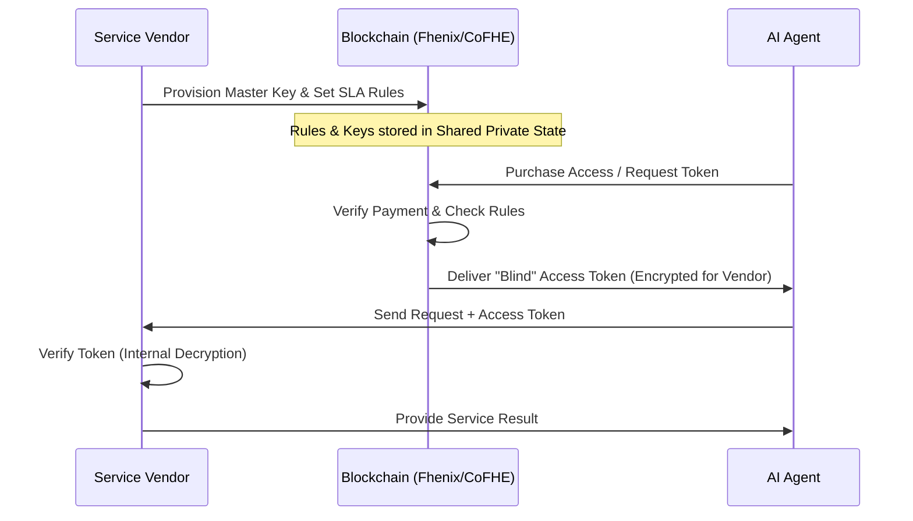

## 1. Project Overview

The **Agentic Secret Management (ASM)** system is a decentralized infrastructure designed to allow AI agents to use sensitive API credentials and perform paid actions without ever "seeing" the actual secrets. By leveraging **shared private state** on-chain, the system enables a secondary market for API access, programmable service-level agreements (SLAs), and cryptographically secure "blind" execution.

## 2. Problem Statement

* **Credential Leakage:** AI agents currently require plaintext secrets, which can be leaked via chat logs, model training, or accidental exports.
* **The "Goldfish Bowl" Problem:** Traditional blockchains are transparent, making it impossible to store "master keys" or private business logic on-chain without exposing them to competitors.
* **Underutilized Assets:** Users often pay for API tiers they don't fully use but have no secure way to "sublet" that access to others.
* **Payment Friction:** Existing agentic payment protocols (like x402) are cumbersome, requiring multiple roundtrips and middlemen.

## 3. The Solution: The "Blind Courier" Model

The system treats the AI agent as a **Blind Courier**. The agent receives an "Access Token" that is encrypted specifically for the Service Vendor. The agent can pass this token to the Vendor to prove it has permission to use a service, but the agent itself cannot decrypt the token to see the underlying secret.

## 4. User Roles

* **Service Vendors:** Provide APIs or services. They issue "Master Keys" and define the rules (price, duration, limits) on-chain.
* **Resource Owners (Users):** Purchase or deposit API access. They can delegate this access to AI agents or list "unused" access time for resale.
* **AI Agents:** Perform tasks on behalf of users. They handle encrypted tokens to interact with Vendor APIs but remain restricted by the token's embedded logic.

## 5. Key Features

* **Programmable On-Chain SLAs:** Vendors can enforce complex rules (e.g., "only allow requests if the user has a specific reputation score") without revealing the user's data or the vendor's internal criteria.
* **Automated Resale Market (Future):** Owners can "prorate" their API access. If an owner has 50% of their monthly quota left, the system allows them to sell that remaining access to an agent automatically. *(The cryptographic design for homomorphic rate-limit subdivision and double-spend prevention is an open problem — this feature is scoped for a future version.)*
* **Confidential Governance:** DAO treasuries or organizations can manage their service subscriptions and payments privately, hiding their operating costs from competitors.
* **One-Step Agentic Payments:** Replaces the multi-step "402" flow. The payment and the access proof are bundled into a single encrypted token delivery.

## 6. High-Level Workflow

## 7. System Requirements

### 7.1 Functional Requirements
* **Issuance:** The system must generate session tokens with a configurable TTL. Replay protection is achieved via random nonces and vendor-side nonce tracking, not per-request intent binding (which would require a new FHE derivation per API call).
* **Compliance:** The system must support compound checks (e.g., age, location, accreditation) on encrypted identity data before issuing a token.
* **Interoperability:** The "Access Token" must be deliverable via standard HTTP headers (e.g., Authorization: Bearer).
* **Vendor Autonomy:** Vendors must be able to validate tokens off-chain instantly without waiting for blockchain confirmations for every request.

### 7.2 Non-Functional Requirements

* **Privacy:** Neither the AI agent, the model provider, nor any blockchain observer should be able to see the "Master Key" or the contents of the "Access Token".
* **Scalability:** Token issuance must be handled by an off-chain coprocessor to ensure the network can handle high-frequency agentic requests.
* **Durability:** The FHE layer's lattice-based cryptography is resistant to future quantum computing threats. The broader system (Ethereum ECDSA, EigenLayer) inherits the quantum-resistance posture of the underlying L1/L2 infrastructure.

## 8. Out of Scope

* **Client Implementation:** Developing the specific logic for how an AI agent chooses to spend its money.
* **Key Recovery:** Providing a "lost password" service for the master keys (this is the Vendor's responsibility).
* **Direct API Proxies:** The system provides the *credentials*, it does not act as a middleman for the actual API data traffic.