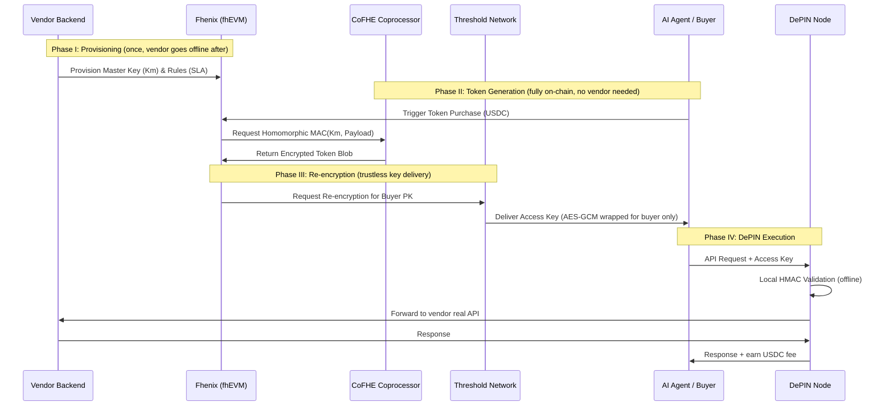

## 1. Elaborated document - what was missing

---

## Abstract

The API key management industry operates on a fundamentally broken trust model. Vendors issue static bearer tokens with no cryptographic enforcement of access rules. Rate limits, expiry, and usage constraints live in vendor databases, enforced by vendor policy - not mathematics. A single server compromise exposes every issued credential. This paper introduces **KeyForge**, a decentralized API access marketplace that replaces vendor trust with cryptographic guarantees. Access tokens are derived via HMAC-SHA256 from a master key protected by Fully Homomorphic Encryption on-chain, validated offline by a decentralized network of proxy nodes (DePIN), and bound cryptographically to the buyer's wallet identity. The result is an API access layer where rules are enforced by math, master keys are unreadable by anyone including the vendor's own infrastructure, and no single point of failure exists in the validation path.

---

## 1. Architectural Overview

The system follows the **"Glue and Coprocessor"** model, where the Ethereum-compatible Layer 2 (L2) handles business logic and state management ("glue"), while the **CoFHE (Collaborative FHE) Coprocessor** handles intensive encrypted computations.

### 1.1 System Components

* **On-Chain Layer (Fhenix L2):** Built on the **Arbitrum Nitro stack**, it manages encrypted state using the `FHE.sol` library. Handles vendor registration, buyer payments in USDC, token commitment storage via keccak256, and rate limit enforcement at issuance time.

* **CoFHE Coprocessor:** A specialized, stateless engine that offloads heavy FHE tasks from the main execution thread. Published benchmarks report significant throughput improvements for simple FHE operations (addition, comparison); complex operations like homomorphic MAC computation will have higher latency.

* **Threshold Services Network (TSN):** A decentralized network of nodes using **Threshold FHE Decryption** and **MPC Rounding** to securely re-encrypt or reveal data. Operates on an N/2-of-N trust model - no single node can decrypt unilaterally, preventing insider attacks.

* **DePIN Proxy Network:** A permissionless network of independently operated validator nodes that sit between API buyers and vendor endpoints. Nodes stake tokens for economic accountability, validate derived keys locally via HMAC recomputation (no blockchain call required), forward valid requests to the vendor's real API, and earn USDC per validated request. This layer eliminates the vendor proxy as a single point of failure and replaces it with a decentralized, economically incentivized network. Anyone can join by running the node software and staking the minimum required collateral.

* **Security Layer:** Secured via **EigenLayer restaking**, providing economic security for data availability and threshold operations. Nodes that misbehave - dropping requests, faking validations, colluding to expose keys - are slashed, losing their staked collateral.

* **Vendor Marketplace:** An on-chain registry where vendors list their APIs, pricing tiers, and access rules. Buyers discover vendors, compare offerings, and purchase access in a single transaction. The marketplace is non-custodial - funds flow directly from buyer to smart contract, with automatic distribution to vendors and nodes.

### 1.2 Comparison with Existing Solutions

| Property | Traditional API keys | OAuth 2.0 | KeyForge |
|---|---|---|---|
| Rules enforcement | Vendor database | Auth server | Cryptography |
| Master secret location | Vendor server | Auth server | FHE on-chain |
| Key binding | None (bearer) | User session | Wallet identity |
| Validation | Network call to vendor | Network call to auth server | Local HMAC (offline) |
| Single point of failure | Vendor server | Auth server | None (DePIN) |
| Auditable issuance | No | No | On-chain commitments |
| Post-quantum confidentiality | No | No | Yes (lattice-based FHE) |

### 1.3 Threat Model

The FHE layer's primary security goal is **vendor infrastructure elimination**: vendors deposit their master key ($K_m$) on-chain in encrypted form and the contract computes access tokens homomorphically, removing the need for vendors to operate a dedicated signing/token-issuance server. The vendor retains knowledge of $K_m$ (they generated it) and uses it for off-chain validation. FHE does **not** protect $K_m$ from the vendor - it protects $K_m$ from all other parties (agents, blockchain observers, other contracts) and enables trustless, non-interactive token issuance without vendor availability.

In other words: the vendor could run a signing service themselves, but the FHE layer means they don't have to. Token issuance happens on-chain 24/7 without vendor uptime, while the key remains confidential to everyone except its owner.

**Threats addressed:**
- **Credential theft at rest:** FHE encryption means the master key has no plaintext representation anywhere on-chain. A full database dump of the blockchain reveals nothing.
- **Credential theft in transit:** Key delivery via TSN re-encryption means the derived key is wrapped specifically for the buyer's public key. Only the buyer's private key can unwrap it.
- **Replay attacks:** Random nonces in every token prevent replaying a captured valid request. The vendor maintains a seen-nonce set evicted after TTL expiry.
- **Over-issuance:** On-chain rate limit enforcement at issuance time prevents a compromised vendor server from issuing unlimited tokens.
- **Proxy node collusion:** EigenLayer staking and N/2-of-N threshold trust means a majority of nodes must collude to break security - economically irrational given slashing.
- **Threats not addressed:** Compromise of the vendor's own machine (they hold $K_m$). Compromise of more than N/2 TSN nodes simultaneously. Quantum attacks on the ECDSA layer (EigenLayer, Ethereum itself).

---

## 2. Cryptographic Stack

The FHE layer of the ASM protocol utilizes lattice-based cryptography, which is inherently **post-quantum secure**. Note that the end-to-end system also relies on Ethereum (ECDSA) and EigenLayer infrastructure, which are not post-quantum resistant. The post-quantum property applies specifically to the confidentiality of encrypted on-chain state.

### 2.1 Primary Primitives

**secp256k1 (ECDSA):** Used for vendor registration and buyer wallet binding. The vendor's Ethereum wallet signs the registration transaction. The buyer's wallet address is embedded in the derived key's input payload, binding the key to a specific identity. Standard Ethereum tooling - no custom implementation required.

**HMAC-SHA256:** The key derivation primitive for the current PoC implementation. Given the master key $K_m$ and a structured payload containing the buyer's wallet address, a nonce, maximum use count, and expiry timestamp, produces a deterministic derived key:

$$dk = \mathrm{HMAC\text{-}SHA256}(K_m,\ \mathrm{wallet} \| \mathrm{nonce} \| \mathrm{max\_uses} \| \mathrm{expiry})$$

This runs off-chain on the vendor's server (PoC) or on-chain via homomorphic MAC (target architecture). Recomputing this at validation time requires only the cached $K_m$ - no network call, no state lookup. Validation latency is sub-millisecond.

**Keccak-256:** Used for on-chain commitment storage. The derived key itself is never stored on-chain. Instead, its hash is recorded:

$$\text{commitment} = \text{keccak256}(dk)$$

This commitment proves a key was legitimately issued without revealing the key. It also anchors the on-chain use counter - the contract increments a counter keyed by commitment on each validated request report from DePIN nodes.

**TFHE & BFV:** The core FHE schemes for encrypted integers (`euint8`–`euint256`) and booleans (`ebool`). TFHE operates on binary circuits and is optimized for gate-by-gate operations. BFV operates on integer arithmetic and is more efficient for polynomial computations. The master key is stored as `euint256`, providing a 256-bit encrypted integer - equivalent security to AES-256.

**Homomorphic MAC:** The MAC primitive for token generation must be TFHE-friendly. Poseidon hash (designed for ZK-SNARK prime-field arithmetic) is **not suitable** for TFHE's binary/integer circuits - its round function involves field exponentiations that map poorly to binary gates. Candidate alternatives include constructions based on TFHE-native operations (encrypted integer addition, multiplication, bitwise ops) or FHE-optimized ciphers such as LowMC or Kreyvium. The choice of MAC primitive is an **open research question** for the PoC.

**Symmetric wrapping:** Converting FHE-encrypted tokens into standard symmetric ciphertext for vendor consumption. AES trans-ciphering under TFHE is prohibitively expensive at current performance levels (minutes per block). FHE-friendly ciphers (Pasta, Elisabeth) designed for efficient homomorphic evaluation should be investigated as alternatives.

---

## 3. Data Flow: The "Blind Courier" Protocol

The analogy: The agent receives an Access Token containing structured data (identity, expiry, limits) plus an HMAC tag computed from the vendor's master key. The agent can present this token to prove permission, but cannot forge a new valid token or recover the master key from the tag. This is analogous to a notary's signature: it proves the legitimacy and authorization of a document without revealing the private key that produced it.

This property is enforced not by policy ("we promise not to show agents the keys") but by cryptography. The token is encrypted under the vendor's public key via the Threshold Services Network. No amount of inspection, memory reading, or model introspection allows the agent to recover the plaintext key. The math makes it impossible.

### 3.1 PoC Flow (Vendor Online)

In the initial implementation, the vendor server participates in key issuance. This is fully buildable today.

```
Vendor → uploads FHE-encrypted Km to blockchain (once)
Buyer  → pays USDC to smart contract
         contract emits KeyIssued(wallet, nonce, max_uses, expiry)
Vendor → server detects event
         decrypts Km locally
         computes dk = HMAC-SHA256(Km, payload)
         sends dk to buyer over encrypted channel
Buyer  → calls DePIN proxy node with dk in Authorization header
Node   → recomputes HMAC locally, checks expiry
         increments on-chain use counter if N-uses model
         forwards request to vendor's real API endpoint
         receives response, returns to buyer
         earns USDC fee from smart contract
```

### 3.2 Target Flow (Vendor Offline - Full Architecture)



---

## 4. On-Chain Implementation (Solidity)

### 4.1 Encrypted Data Types

* `mapping(address => euint256) private masterKeys`: Stores the Vendor's 256-bit master secret in encrypted form. Using `euint256` ensures standard cryptographic key lengths (AES-256, Ed25519) and adequate post-quantum security margins.

* `mapping(bytes32 => uint256) private usageCounts`: Tracks per-commitment usage. Keyed by keccak256(derived_key). DePIN nodes report usage periodically; contract enforces coarse limits.

* `mapping(uint256 => bool) private tokenStatus`: Tracks the validity of issued tokens. Token validity (valid/revoked) is not sensitive data - a plaintext mapping with standard access control avoids unnecessary CoFHE overhead.

* `mapping(address => uint256) private nodeStakes`: Records staked collateral per DePIN node. Used for slashing on provable misbehavior.

### 4.2 Homomorphic Token Logic

The contract utilizes `FHE.select()` and `FHE.mul()` to construct the token payload without decrypting the $K_m$.
* **Input:** User Identity (wallet address), Expiry (TTL), Nonce.
* **Operation:** $Token = \text{TFHE-MAC}(K_m, \text{Payload})$ - the specific MAC construction must use TFHE-native operations (see §2.1).
* **Output:** An encrypted ciphertext passed to the TSN for re-encryption.

### 4.3 DePIN Node Registration

```solidity
function registerNode(uint256 stakeAmount) external {
    require(stakeAmount >= MIN_STAKE, "insufficient stake");
    usdc.transferFrom(msg.sender, address(this), stakeAmount);
    nodeStakes[msg.sender] = stakeAmount;
    emit NodeRegistered(msg.sender, stakeAmount);
}

function slashNode(address node, bytes calldata proof) external onlyGovernance {
    // verify fraud proof, burn stake
    uint256 stake = nodeStakes[node];
    nodeStakes[node] = 0;
    emit NodeSlashed(node, stake);
}
```

---

## 5. Vendor-Side Validation (Off-Chain)

Vendors do not need to interact with the Fhenix blockchain for every request. They validate the **Access Key** using a standard cryptographic library based on the **ASM Validator Specification**.

### 5.1 Validation Workflow

1. **Decryption:** Use the Vendor Private Key ($SK_{Vendor}$) to decrypt the AES-GCM blob received in the `Authorization` header.
2. **Parsing:** Extract the binary payload (ID, Expiry, Nonce, MAC Tag).
3. **Integrity Check:** Re-compute the MAC locally using the original $K_m$ and compare it to the decrypted Tag.
4. **Nonce check:** Verify nonce has not been seen within the current TTL window.
5. **Expiry check:** Verify current timestamp is before expiry field.

### 5.2 Nonce Management

Nonces are **random** (not sequential) to avoid the serialization bottleneck of maintaining a monotonic encrypted counter under FHE. The vendor must maintain a set of seen nonces within the token's TTL window and reject duplicates to prevent replay attacks. Nonces older than the TTL can be evicted.

A time-bucketed bloom filter is a practical implementation: maintain two bloom filters representing the current and previous TTL window. On each request, check both. At each TTL boundary, discard the oldest and create a fresh one. This bounds memory usage to $O(requests\_per\_TTL)$ with a tunable false positive rate.

### 5.3 Rate Limit Enforcement

Rate limits defined on-chain (§4.2) are enforced through a **hybrid model**:
* **At issuance (on-chain):** The contract enforces coarse-grained limits by tracking total tokens issued per subscription period. This prevents over-issuance.
* **At validation (off-chain):** The vendor and DePIN nodes track per-token usage counts locally. Nodes periodically report usage back on-chain for reconciliation. Reports are aggregated off-chain using a simple merkle rollup and submitted in batches to minimize gas costs.
* Rate limits are **advisory at the per-request level** and **enforced at the issuance level**. This is a pragmatic trade-off: on-chain enforcement per API call is infeasible, but issuance-time gating bounds total access.

---

## 6. DePIN Economics

### 6.1 Fee Distribution

Every API request processed by the network triggers a micro-payment. For a request priced at $P$ USDC:

| Recipient | Share | Rationale |
|---|---|---|
| Vendor | 80% | API service provider |
| DePIN node | 15% | Validation + forwarding |
| Protocol treasury | 5% | Development, governance |

Payments are batched - nodes submit signed usage reports periodically, the contract verifies and distributes. This avoids per-request gas costs.

### 6.2 Node Incentive Structure

Nodes earn more by processing more requests. They compete on latency and uptime - buyers' clients select the fastest responding node. This creates natural market pressure for well-operated nodes without requiring central coordination.

Slashing conditions: provable dropped requests (buyer receives no response but node claims fee), provable invalid validations (node passes a request with an invalid key), collusion with TSN nodes (detectable via cryptographic proofs).

---

## 7. Security and Performance Metrics

* **Token Model:** Access Keys are **session tokens** with a TTL of $N$ hours. They are not bound to a specific request body, allowing reuse across multiple API calls within the validity window. This avoids the need for a new FHE derivation per request, which would be impractical given CoFHE latency.

* **Validation Latency:** Off-chain HMAC recomputation at a DePIN node takes under 1ms. Total added latency per request (node overhead) is dominated by network round-trip, not computation - estimated 5-20ms depending on node geography.

* **Throughput:** The **MPC Rounding protocol** (CCS 2025) enables significant performance improvements for the TSN's re-encryption and threshold decryption operations. Note: published benchmarks (e.g., "5,000x throughput," "20,000x faster") measure simple FHE operations (addition, comparison, threshold decryption). Homomorphic MAC computation is substantially more complex and will exhibit higher latency - real-world performance for token generation should be benchmarked independently.

* **Trust Model:** $N/2$-of-$N$ threshold trust for the decryption network, combined with optimistic fraud proofs compiled to **WASM** for on-chain verification.

* **Post-quantum security scope:** The lattice-based FHE layer is post-quantum secure for confidentiality of $K_m$. The ECDSA layer (wallet signatures, EigenLayer) is not. A full post-quantum upgrade would require replacing secp256k1 with a lattice-based signature scheme (e.g., CRYSTALS-Dilithium), which is out of scope for the current design.

---

## 8. Open Research Questions

* **MAC primitive selection:** Identifying or constructing a MAC that is both cryptographically sound and efficiently computable under TFHE's binary/integer circuit model (see §2.1). Candidate evaluation should benchmark LowMC, Kreyvium, and custom integer-arithmetic constructions against a target of sub-10-second token generation on CoFHE hardware.

* **Symmetric wrapping performance:** Evaluating FHE-friendly cipher candidates (Pasta, Elisabeth, Kreyvium) for practical trans-ciphering latency. Target: under 30 seconds per token wrap on current CoFHE benchmarks.

* **Resale mechanism:** The Requirements document describes automated prorated resale of API access. The cryptographic design for homomorphic subdivision of rate limits and double-spend prevention is deferred to a future specification version.

* **DePIN node selection and routing:** Optimal strategies for client-side node selection (latency-based, stake-weighted, random) and their impact on network decentralization and censorship resistance.

* **Fraud proof completeness:** Defining a complete set of provable slashing conditions for DePIN node misbehavior, and the on-chain verification cost of each.
