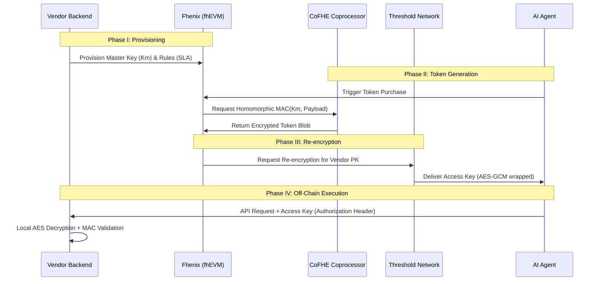

## 1. Architectural Overview

The system follows the **"Glue and Coprocessor"** model, where the Ethereum-compatible Layer 2 (L2) handles business logic and state management ("glue"), while the **CoFHE (Collaborative FHE) Coprocessor** handles intensive encrypted computations.

### 1.1 System Components

* **On-Chain Layer (Fhenix L2):** Built on the **Arbitrum Nitro stack**, it manages encrypted state using the `FHE.sol` library.
* **CoFHE Coprocessor:** A specialized, stateless engine that offloads heavy FHE tasks from the main execution thread. Published benchmarks report significant throughput improvements for simple FHE operations (addition, comparison); complex operations like homomorphic MAC computation will have higher latency.
* **Threshold Services Network (TSN):** A decentralized network of nodes using **Threshold FHE Decryption** and **MPC Rounding** to securely re-encrypt or reveal data.
* **Security Layer:** Secured via **EigenLayer restaking**, providing economic security for data availability and threshold operations.

### 1.2 Threat Model

The FHE layer's primary security goal is **vendor infrastructure elimination**: vendors deposit their master key ($K_m$) on-chain in encrypted form and the contract computes access tokens homomorphically, removing the need for vendors to operate a dedicated signing/token-issuance server. The vendor retains knowledge of $K_m$ (they generated it) and uses it for off-chain validation. FHE does **not** protect $K_m$ from the vendor — it protects $K_m$ from all other parties (agents, blockchain observers, other contracts) and enables trustless, non-interactive token issuance without vendor availability.

In other words: the vendor could run a signing service themselves, but the FHE layer means they don't have to. Token issuance happens on-chain 24/7 without vendor uptime, while the key remains confidential to everyone except its owner.

## 2. Cryptographic Stack

The FHE layer of the ASM protocol utilizes lattice-based cryptography, which is inherently **post-quantum secure**. Note that the end-to-end system also relies on Ethereum (ECDSA) and EigenLayer infrastructure, which are not post-quantum resistant. The post-quantum property applies specifically to the confidentiality of encrypted on-chain state.

### 2.1 Primary Primitives

* **TFHE & BFV:** The core FHE schemes for encrypted integers (`euint8`–`euint256`) and booleans (`ebool`).
* **Homomorphic MAC:** The MAC primitive for token generation must be TFHE-friendly. Poseidon hash (designed for ZK-SNARK prime-field arithmetic) is **not suitable** for TFHE's binary/integer circuits. Candidate alternatives include constructions based on TFHE-native operations (encrypted integer addition, multiplication, bitwise ops) or FHE-optimized ciphers such as LowMC or Kreyvium. The choice of MAC primitive is an **open research question** for the PoC.
* **Symmetric wrapping:** Converting FHE-encrypted tokens into standard symmetric ciphertext for vendor consumption. AES trans-ciphering under TFHE is prohibitively expensive at current performance levels (minutes per block). FHE-friendly ciphers (Pasta, Elisabeth) designed for efficient homomorphic evaluation should be investigated as alternatives.

## 3. Data Flow: The "Blind Courier" Protocol

## 4. On-Chain Implementation (Solidity)

The core contract manages the encrypted storage of Master Keys ($K_m$) and session logic. (This is "encrypted storage with authorized computation" — the vendor deposits a secret, and the contract computes on it. True shared private state, where multiple independent parties contribute encrypted inputs, would apply if the resale mechanism is implemented.)

### 4.1 Encrypted Data Types

* `mapping(address => euint256) private masterKeys`: Stores the Vendor's 256-bit master secret in encrypted form. Using `euint256` ensures standard cryptographic key lengths (AES-256, Ed25519) and adequate post-quantum security margins.
* `mapping(uint256 => bool) private tokenStatus`: Tracks the validity of issued tokens. Token validity (valid/revoked) is not sensitive data — a plaintext mapping with standard access control avoids unnecessary CoFHE overhead.

### 4.2 Homomorphic Token Logic

The contract utilizes `FHE.select()` and `FHE.mul()` to construct the token payload without decrypting the $K_m$.
* **Input:** User Identity, Expiry (TTL).
* **Operation:** $Token = TFHE\text{-}MAC(K_m, Payload)$ — the specific MAC construction must use TFHE-native operations (see §2.1).
* **Output:** An encrypted ciphertext passed to the TSN for re-encryption.

## 5. Vendor-Side Validation (Off-Chain)

Vendors do not need to interact with the Fhenix blockchain for every request. They validate the **Access Key** using a standard cryptographic library based on the **ASM Validator Specification**.

### 5.1 Validation Workflow

1. **Decryption:** Use the Vendor Private Key ($SK_{Vendor}$) to decrypt the AES-GCM blob received in the `Authorization` header.
2. **Parsing:** Extract the binary payload (ID, Expiry, Nonce, MAC Tag).
3. **Integrity Check:** Re-compute the MAC locally using the original $K_m$ and compare it to the decrypted Tag.

### 5.2 Nonce Management

Nonces are **random** (not sequential) to avoid the serialization bottleneck of maintaining a monotonic encrypted counter under FHE. The vendor must maintain a set of seen nonces within the token's TTL window and reject duplicates to prevent replay attacks. Nonces older than the TTL can be evicted.

### 5.3 Rate Limit Enforcement

Rate limits defined on-chain (§4.2) are enforced through a **hybrid model**:
* **At issuance (on-chain):** The contract enforces coarse-grained limits by tracking total tokens issued per subscription period. This prevents over-issuance.
* **At validation (off-chain):** The vendor tracks per-token usage counts locally. Vendors periodically report usage back on-chain for reconciliation.
* Rate limits are **advisory at the per-request level** and **enforced at the issuance level**. This is a pragmatic trade-off: on-chain enforcement per API call is infeasible, but issuance-time gating bounds total access.

## 6. Security and Performance Metrics

* **Token Model:** Access Keys are **session tokens** with a TTL of $N$ hours. They are not bound to a specific request body, allowing reuse across multiple API calls within the validity window. This avoids the need for a new FHE derivation per request, which would be impractical given CoFHE latency.
* **Throughput:** The **MPC Rounding protocol** (CCS 2025) enables significant performance improvements for the TSN's re-encryption and threshold decryption operations. Note: published benchmarks (e.g., "5,000x throughput," "20,000x faster") measure simple FHE operations (addition, comparison, threshold decryption). Homomorphic MAC computation is substantially more complex and will exhibit higher latency — real-world performance for token generation should be benchmarked independently.
* **Trust Model:** $N/2$-of-$N$ threshold trust for the decryption network, combined with optimistic fraud proofs compiled to **WASM** for on-chain verification.

## 7. Open Research Questions

* **MAC primitive selection:** Identifying or constructing a MAC that is both cryptographically sound and efficiently computable under TFHE's binary/integer circuit model (see §2.1).
* **Symmetric wrapping performance:** Evaluating FHE-friendly cipher candidates (Pasta, Elisabeth, Kreyvium) for practical trans-ciphering latency.
* **Resale mechanism:** The Requirements document describes automated prorated resale of API access. The cryptographic design for homomorphic subdivision of rate limits and double-spend prevention is deferred to a future specification version.