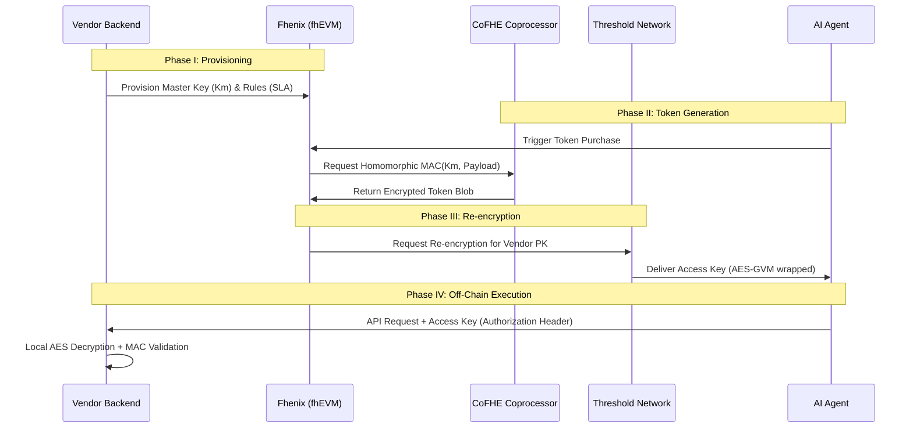

## 1. Architectural Overview

The system follows the **"Glue and Coprocessor"** model, where the Ethereum-compatible Layer 2 (L2) handles business logic and state management ("glue"), while the **CoFHE (Collaborative FHE) Coprocessor** handles intensive encrypted computations.

### 1.1 System Components

* **On-Chain Layer (Fhenix L2):** Built on the **Arbitrum Nitro stack**, it manages encrypted state using the `FHE.sol` library.
* **CoFHE Coprocessor:** A specialized, stateless engine that offloads heavy FHE tasks (like homomorphic MAC generation) from the main execution thread, achieving up to **5,000x throughput**.
* **Threshold Services Network (TSN):** A decentralized network of nodes using **Threshold FHE Decryption** and **MPC Rounding** to securely re-encrypt or reveal data.
* **Security Layer:** Secured via **EigenLayer restaking**, providing economic security for data availability and threshold operations.

## 2. Cryptographic Stack

The ASM protocol utilizes lattice-based cryptography, which is inherently **post-quantum secure**.

### 2.1 Primary Primitives

* **TFHE & BFV:** The core FHE schemes for encrypted integers (`euint`) and booleans (`ebool`).
* **DBFV (Decomposable BFV):** Used to manage large 256-bit integers by breaking them into smaller "limbs" for faster processing.
* **Poseidon Hash:** An arithmetic-friendly hash function used for generating **Homomorphic MACs** inside the FHE circuit.
* **Trans-ciphering (FHE-to-AES):** The process of homomorphically executing an AES circuit to wrap FHE-encrypted data into a standard symmetric ciphertext for Vendor consumption.

## 3. Data Flow: The "Blind Courier" Protocol

## 4. On-Chain Implementation (Solidity)

The core contract manages the **Shared Private State** of Master Keys ($K_m$) and session logic.

### 4.1 Encrypted Data Types

* `mapping(address => euint128) private masterKeys`: Stores the Vendor's master secret in encrypted form.
* `mapping(uint256 => ebool) private tokenStatus`: Tracks the validity of issued tokens homomorphically.

### 4.2 Homomorphic Token Logic

The contract utilizes `FHE.select()` and `FHE.mul()` to construct the token payload without decrypting the $K_m$.
* **Input:** User Identity, Expiry (TTL), and Rate Limits.
* **Operation:** $Token = PoseidonMAC(K_m, Payload)$.
* **Output:** An encrypted LWE ciphertext passed to the TSN for re-encryption.

## 5. Vendor-Side Validation (Off-Chain)

Vendors do not need to interact with the Fhenix blockchain for every request. They validate the **Access Key** using a standard cryptographic library based on the **ASM Validator Specification**.

### 5.1 Validation Workflow

1. **Decryption:** Use the Vendor Private Key ($SK_{Vendor}$) to decrypt the AES-GCM blob received in the `Authorization` header.
2. **Parsing:** Extract the binary payload (ID, Expiry, Nonce, MAC Tag).
3. **Integrity Check:** Re-compute the MAC locally using the original $K_m$ and compare it to the decrypted Tag.
4. **Intent Binding:** Verify that the $Hash(Request Body)$ matches any intent commitment embedded in the token to prevent replay attacks.

## 6. Security and Performance Metrics

* **Latency Management:** TTL (Time-To-Live) for Access Keys is set to $N$ hours to mitigate the asynchronous overhead of CoFHE coprocessing.
* **Throughput:** The **MPC Rounding protocol** (CCS 2025) allows the TSN to handle re-encryption and decryption requests at a rate **20,000x faster** than early FHE implementations.
* **Trust Model:** $N/2$-of-$N$ threshold trust for the decryption network, combined with optimistic fraud proofs compiled to **WASM** for on-chain verification.